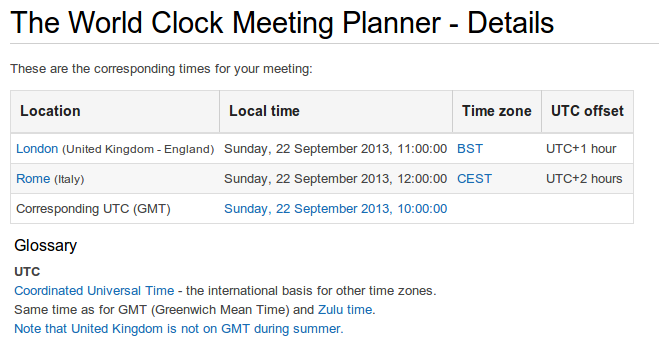

E-Calendar & Time Zone
######################
:date: 2013-06-22 20:31
:author: nomed
:category: Misc
:slug: e-calendar-time-zone

As i've been asked to fix the issue of e-meeting , let me say there
isn't any solution. You shouldn't trust electronic calendar if you're
not in the same time-zone of sender.

Here are some reasons why time zone changes can be quite complicated:

-  *Every year, a lot of countries switch between Standard Time (ST) and
   Daylight Saving Time (DST), and, unfortunately, they don’t do it at
   the same time. For example, in 2011, Europe switched back from DST to
   ST on Oct 30, while the continental U.S. switched on Nov 6. This
   means that the standard 5 hours difference between New York and
   London was 4 hours between Oct 30 and Nov 6.*
-  *Every year, several countries decide to change their time zones or
   DST rules entirely. Recent examples include Russia, Chile, Belarus,
   and Egypt. Moscow used to be UTC+3 in the winter and UTC+4 during the
   summer, but when Russia decided to stay away from DST as of November
   2011, Moscow became UTC+4 all year round.*

In June we have:

**Rome: UTC+2h**
**London: UTC+1h**

While in February we have:

**Rome: UTC+1h**
**London: UTC**

My suggestion if you have to define a meeting Rome/London is to use
e-mail and standard utc.

from
`www.timeanddate.com <http://www.timeanddate.com/worldclock/meetingdetails.html>`__

Following a screenshot for a meeting Rome/London on 22 Sept 2013 - 10:00
UTC:

Here a link to check current time `time.is <http://time.is/>`__

Check this before to organize a meeting `Meeting Planner
<http://www.timeanddate.com/worldclock/meeting.html>`__

